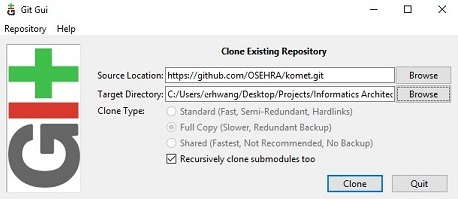
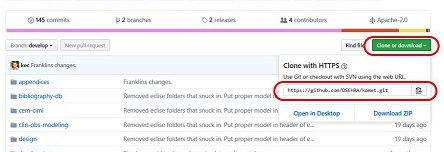
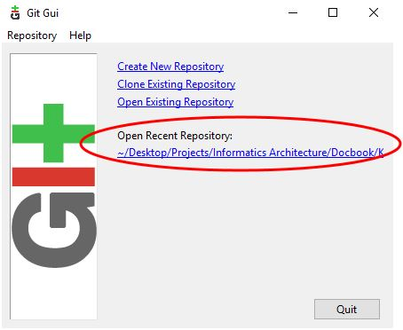
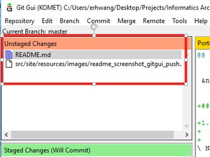
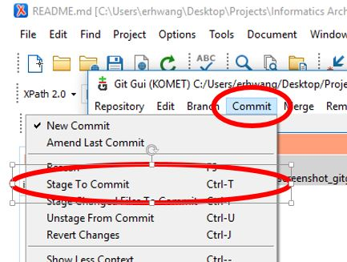
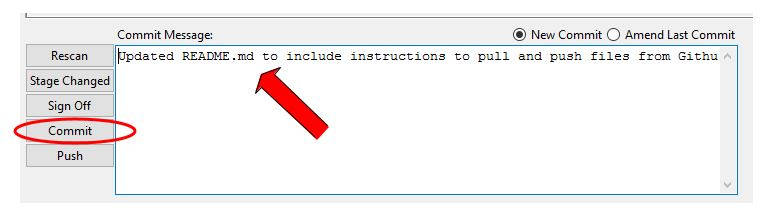

# README #

## What is this repository for? ##

This repository is to provide for collaborative development of documentation for **I**nformatic**S** **A**rchitecture **AC**celeration's (ISAAC) **K**n**O**wledge **M**anagement **E**nvironmen**T** (KOMET). 

## How do I get set up? ##

### Viewing generated KOMET Compendium PDF and HTML files ###
Generated pdf and html files can be found in [informatics-architecture.net](http://informatics-architecture.net/isaacs.komet.web/isaacs-komet-compendium/index.html)

### Editing Docbook ###
This is a maven/docbook project. To edit docbook XML files, following installations are recommended:

1. JAVA
    + If your machine does not have JAVA, download and install Java SE: [Java Download](http://www.oracle.com/technetwork/java/javase/downloads/index.html)  
&nbsp;
2. Maven
    + Download and unzip from: [Maven Download](https://maven.apache.org/download.cgi)  
&nbsp;
3. Git GUI (update this with sourcetree)
    + Download and install from: [Git GUI Download](https://git-scm.com/downloads)
    + Recommend keeping all default options
    + Run **Git GUI** and select **Clone Existing Repository**
    + Clone Existing Repository  
      
      
        + Source Location
            + get link and copy into **Source Location**
                + Go to [KOMET github](https://github.com/OSEHRA/komet)
                + Select **Clone or download** and copy link:
                    
&nbsp;
        + Target Directory – enter the path of the directory & folder name
            + Note: do not create the folder itself – Git will create the folder in the specified directory path
        + Click on **Clone**
        + Close Git Gui once the project has been downloaded  
&nbsp;
4.	Build the clone source code
    + Open command prompt 
    + Change directory to directory created in __Target Directory step of Git GUI installation__
    + Type **mvn clean install** and close command prompt after clean install  
&nbsp;
5.	Oxygen XML Editor
    + Download and install from [Oxygen XML Editor](https://www.oxygenxml.com/)
        + Select File Association – recommend selecting **XML Document**
        + sign up for 30-day evaluation key
    + When you start the program, enter 30-day trial license key:
        
&nbsp;
    + Once opened, Oxygen XML Editor should look like:
        
&nbsp;
    + select **File** > **Open** > go to the folder created in _Target Directory step of Git GUI installation_ > select **isaacs-komet-doc.xpr**

### Committing and pushing edited files to GitHub ###

1. Git GUI (update this with sourcetree)
    + Open Git GUI and select recent repository
         
&nbsp;
    + Stage the files you want to commit  
         
&nbsp;
    + Select **Commit** > **Stage to Commit**  
         
&nbsp;  
    + Enter comment and press Commit
         